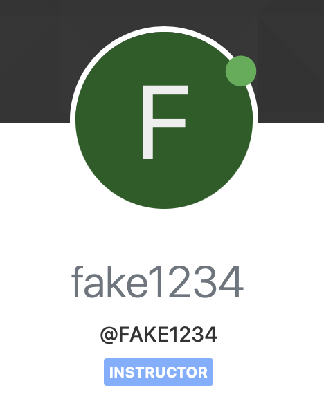
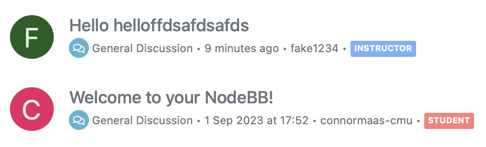

# User Guide

## Role Identifier By User

We've introduced a visible tag that appears in multiple locations, such as the profile and topics sections. This tag identifies the account type of the user. The available account types are "instructor" and "student." Additionally, we've implemented distinct color schemes for each role: instructors are represented with a blue tag, while students have a red tag.

### Profile View

#### Tests for this Implementation:
- [Test 1](https://github.com/CMU-313/fall23-nodebb-pittbegels/blob/3cef121efef15ec2617905e6287b2a358d3d7ee8/test/controllers.js#L1361)
- [Test 2](https://github.com/CMU-313/fall23-nodebb-pittbegels/blob/3cef121efef15ec2617905e6287b2a358d3d7ee8/test/controllers.js#L1376)
- [Test 3](https://github.com/CMU-313/fall23-nodebb-pittbegels/blob/3cef121efef15ec2617905e6287b2a358d3d7ee8/test/controllers.js#L1391)

### Topics View

#### Test for this Implementation:
- [Test 1](https://github.com/CMU-313/fall23-nodebb-pittbegels/blob/3cef121efef15ec2617905e6287b2a358d3d7ee8/test/topics.js#L589C11-L589C11)

## Recaptcha

*This section will be updated once the Recaptcha feature is implemented.*
